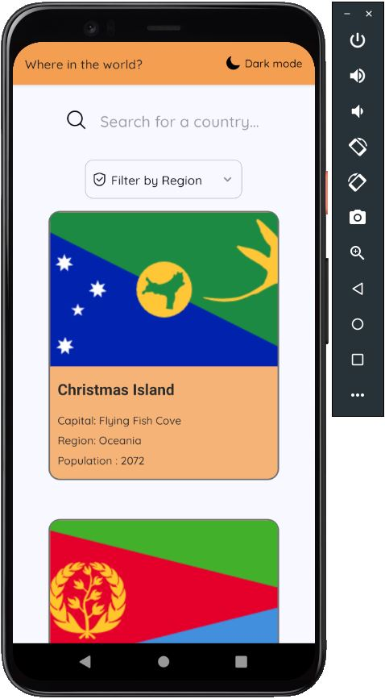

Where In The World?:
The purpose of this application is to be able to obtain data from countries whose functionalities are to receive, filter and save data.

Usage:
The application contains a search engine and a filter by region, you can access the data for each country by clicking on each Card.

Capture:

